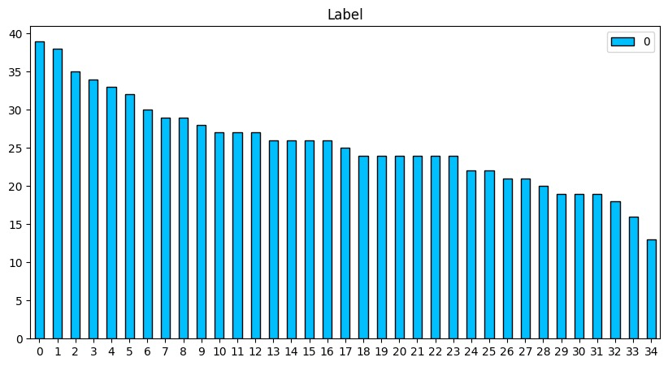
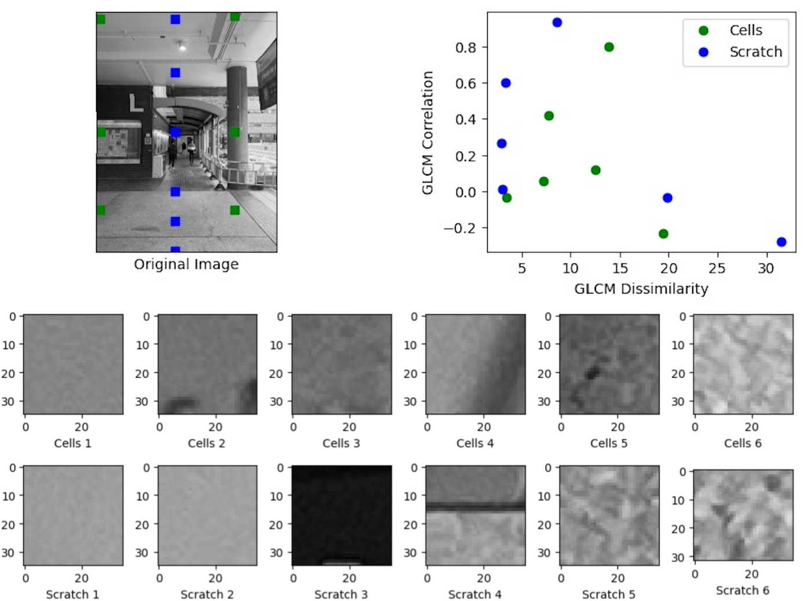
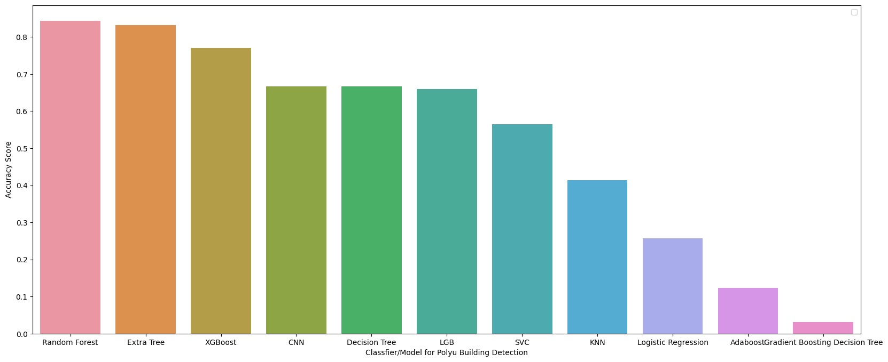
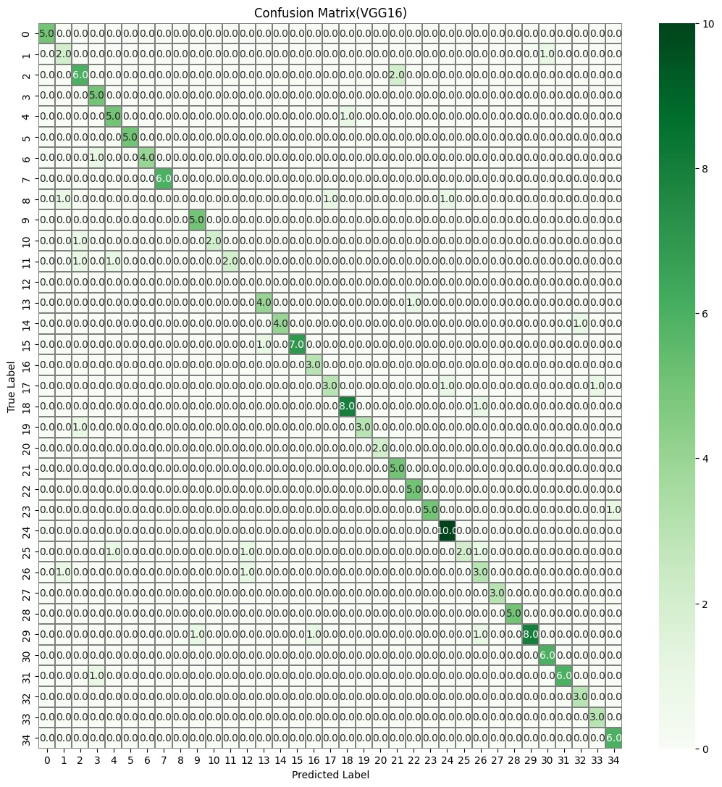
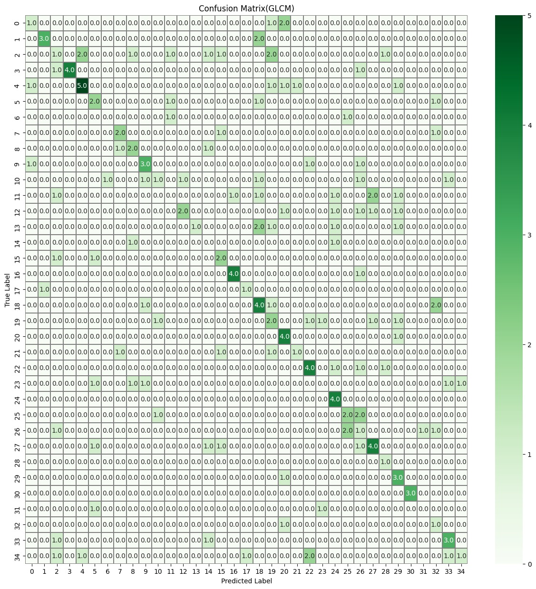
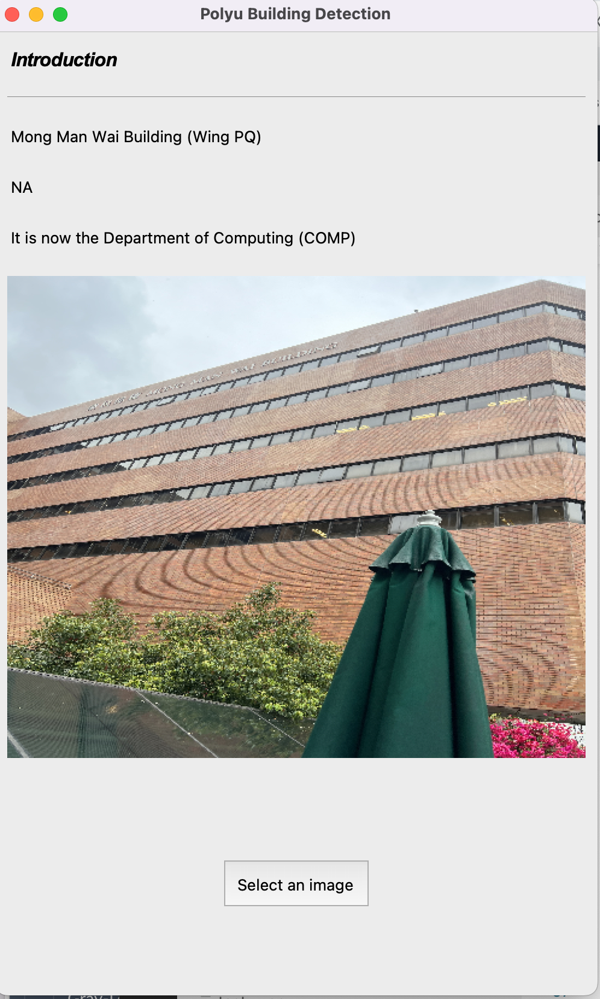

# Building Recognition System 

## Demo
https://github.com/fletcherjiang/Building_Recognition_System-/assets/51084226/320b9ed8-9ade-4dfc-a3b7-938f33d42468

## Overview
This project develops a computer vision model to detect and classify buildings from images. The deep learning model, trained on a dataset of building images, accurately predicts building presence and classifies them by name using state-of-the-art techniques.

## Data Collection
The dataset comprises 891 images across 35 categories, with at least 15 images per category. 

## Feature Extraction and Classification
### Feature Extraction Methods
- **VGG16 Network**: Used for high-level image feature extraction. Configured without the top layer to customize for our specific classification tasks.
- **Gray-Level Co-occurrence Matrix (GLCM)**: Used for extracting texture features from images. GLCM properties such as dissimilarity and correlation are used for further analysis.

### Classification
The data was organized into 35 categories. Automated image processing and label encoding were utilized for efficient data handling.

## Models and Performance
Multiple machine learning models were evaluated with Random Forest, Extra Tree, and XGBoost showing the best performance.

## Testing and Metrics
- **Accuracy** and **Confusion Matrix** are the primary metrics.
- All images were resized to 256x256 and pixel values normalized to enhance model performance.

## Problems and Solutions
### Challenges
- **Label Classification**: Automated folder name reading and `LabelEncoder()` were used to streamline data labeling.
- **Uneven Label Distribution**: Additional data was captured to balance the dataset.
- **Model Parameter Tuning**: Utilized `GridSearchCV` for efficient hyperparameter tuning.

### Confusion Matrix Comparison
Comparison between VGG16 and GLCM based on their confusion matrices:

## GUI and Web Application
A GUI and a mobile web application were developed to facilitate easy model interaction and testing.

## Conclusion
The model achieved an 84% test accuracy, effectively classifying buildings while avoiding overfitting.

## Access the System
Test the model online at: [Building Recognition System](http://imjyy.com:8080)

---

